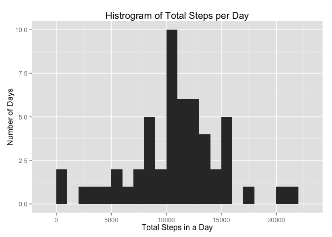
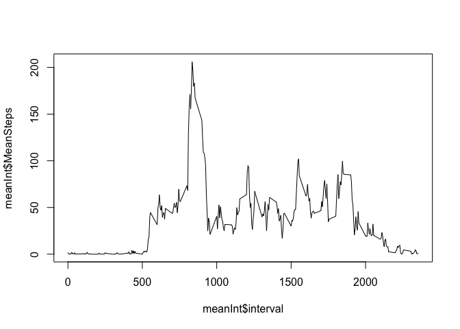

# Reproducible Research: Peer Assessment 1
Test

## Loading and preprocessing the data


```r
# 1. Reading in the data:
# Data downloaded on 08/15/2015
download.file("https://d396qusza40orc.cloudfront.net/repdata%2Fdata%2Factivity.zip", 
              "data/data.zip", method ="curl")
unzip("data/data.zip", exdir = "data")

data <- read.csv("data/activity.csv")
data$date <- as.Date(as.character(data$date))
data$steps <- as.numeric(data$steps)
```


## What is mean total number of steps taken per day?


```r
# 2. Total steps per day -> histogram -> report mean/median
library("plyr")
library("ggplot2")
library("xtable")
library("reshape2")

## Total steps
daySums <- ddply(data[,c("date","steps")], .(date), summarise,
                 TotalSteps = sum(steps))
names(daySums)[2] <- "steps"

## Making histogram
histogram <- ggplot(daySums, aes(steps)) + 
    geom_bar(binwidth=1000) + # geom_bar in ggplot makes a histogram with one variable
    xlab("Total Steps in a Day") +
    ylab("Number of Days") +
    ggtitle("Histrogram of Total Steps per Day")
histogram
```

 


```r
## Calculating Median and Mean
values <- data.frame(Mean = mean(daySums$steps, na.rm = T), 
                     Median = median(daySums$steps, na.rm = T))

valTable <- xtable(values)
print(valTable, type="html", include.rowname=F)
```

<!-- html table generated in R 3.1.1 by xtable 1.7-4 package -->
<!-- Sat Aug 15 18:32:57 2015 -->
<table border=1>
<tr> <th> Mean </th> <th> Median </th>  </tr>
  <tr> <td align="right"> 10766.19 </td> <td align="right"> 10765.00 </td> </tr>
   </table>

## What is the average daily activity pattern?


```r
# 3. Time series of 5 min periods averaged accross all days
## Calculating interval means over all days
meanInt <- ddply(data[,c("interval","steps")], .(interval), summarise,
                 MeanSteps = mean(steps, na.rm = T))
plot(meanInt$interval,meanInt$MeanSteps, type="l")
```

 


```r
## Determining the highest averaging interval
maximum <- meanInt[meanInt$MeanSteps == max(meanInt$MeanSteps),]
maxTable <- xtable(maximum)
print(maxTable, type="html", include.rowname=F)
```

<!-- html table generated in R 3.1.1 by xtable 1.7-4 package -->
<!-- Sat Aug 15 18:32:57 2015 -->
<table border=1>
<tr> <th> interval </th> <th> MeanSteps </th>  </tr>
  <tr> <td align="right"> 835 </td> <td align="right"> 206.17 </td> </tr>
   </table>


## Imputing missing values


## Are there differences in activity patterns between weekdays and weekends?
